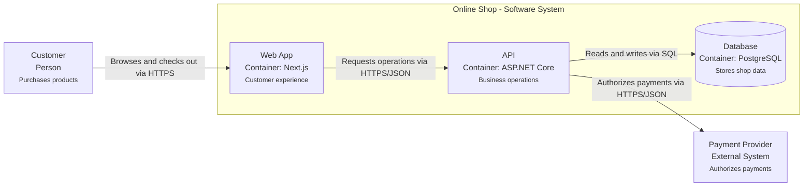

# Diagram Notation

C4 is notation- and tooling-independent. Optimize for clarity, consistency, version control, and reliable rendering.

## Textual Inventory

Keep an inventory next to each diagram:

| ID | Element | C4 type | Responsibility | Technology |
| --- | --- | --- | --- | --- |
| `system_shop` | Online Shop | Software system | Enables customers to buy products | - |
| `container_web` | Web App | Container | Customer-facing browser experience | Next.js |

For a Context view, omit technology unless it materially clarifies an external system. For Container and Component views, include major technology choices where useful.

## Relationships

Each relationship states:

- Direction
- Business or technical intent as a verb phrase
- Protocol or technology only when useful at that level
- Important asynchronous, trust, or ownership characteristics when relevant

Good: `Submits orders via HTTPS/JSON`

Weak: `Uses`

Bad: An unlabeled line

Avoid bidirectional arrows. Draw two directed relationships when each direction has a distinct purpose.

## Mermaid

Prefer standard Mermaid flowcharts for Context and Container views because they render on GitHub without specialized C4 tooling:

Use a `sequenceDiagram` for Dynamic views. Use flowcharts with deployment-node subgraphs for simple Deployment views.

## Required Diagram Metadata

Each view states:

- Title
- C4 view type
- Scope
- Purpose or decision supported
- Last verified date when used as long-lived architecture documentation
- Legend when shape, color, or line style carries meaning

## Visual Rules

- Put the element name first and make it prominent.
- State element type explicitly instead of relying only on color.
- Add a short responsibility description.
- Show ownership/system boundaries.
- Keep layout stable when updating existing views.
- Use color sparingly and never as the only source of meaning.
- Split a crowded view by scope instead of shrinking labels.

## Source Of Truth

Textual responsibilities, ADRs, and approved requirements remain authoritative. The diagram is a synchronized view. If diagram and inventory disagree, stop and resolve the discrepancy rather than choosing silently.
