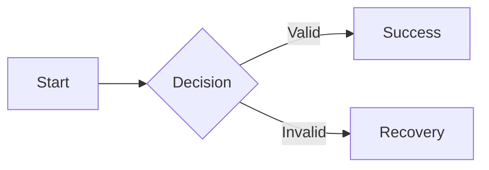

# UX Artifacts

Consolidate feature UX in `.specs/features/<feature>/ux.md` when it provides enough unique value to justify a separate artifact. Otherwise use a section in `design.md`.

## Feature UX Template

````markdown
# <Feature> UX

**Specification:** ./spec.md
**Status:** Draft | Approved | Evaluated

## UX Questions

| Question | Why it matters | Evidence needed |
| --- | --- | --- |

## Users And Context

## Journey

**Trigger:** ...
**Goal:** ...
**Success:** ...
**Failure/recovery:** ...

## Information Architecture

## Primary Task Flow



## Alternate And Recovery Flows

## Screen Or Surface Inventory

| ID | Surface | Purpose | Entry | Exit |
| --- | --- | --- | --- | --- |

## State Matrix

| Surface | Default | Loading | Empty | Error | Offline | Success |
| --- | --- | --- | --- | --- | --- | --- |

## Content And Feedback

## Responsive And Adaptive Behavior

## Accessibility And Input Methods

## Design-System Reuse And Additions

## Prototype Plan And Findings

## Requirement Traceability

| Requirement | Flow/surface | Evidence |
| --- | --- | --- |

## Open Questions And Risks
````

Remove irrelevant columns and sections.

## Information Architecture

Use information architecture to define content grouping, labels, hierarchy, navigation, and findability. Avoid mirroring database or service structure in user navigation unless users understand the domain that way.

For small features, a route or surface list may be enough. Use a sitemap only when several destinations and hierarchy decisions exist.

## Flows

Create one flow per user goal or consequential recovery path. Include:

- Starting context
- User decisions and system decisions
- External handoffs
- Validation and permission failures
- Cancellation and return paths
- Completion and follow-up

Do not add implementation functions or API calls unless a technical sequence is the actual review target.

## States

Consider states deliberately rather than adding every possible column by habit:

- Initial/default
- Loading or processing
- Empty or first use
- Partial data
- Validation error
- System or network failure
- Offline or stale
- Permission denied or unauthenticated
- Success and confirmation
- Destructive-action confirmation and recovery

Define content, available actions, focus behavior, and announcements where relevant.
