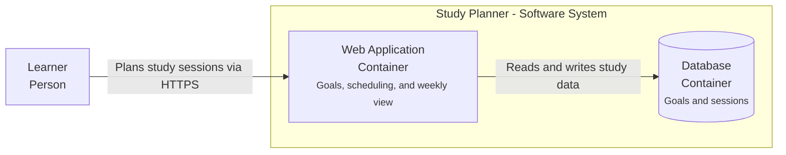

# Tutorial: Plan A Study Planner

This small example demonstrates the harness from product idea to an implementation-ready feature. It is a learning walkthrough, not a template that every project must copy.

## Scenario

You want a personal web application that helps one learner define a learning goal and schedule focused study sessions. The first feature should prevent overlapping sessions and show a useful weekly schedule.

## 1. Start The Project

Create or open an empty project directory and start OpenCode:

```bash
opencode
```

Press `Tab` until `delivery-planner` is selected, then say:

```text
Initialize a new Study Planner product using TLC. Use guided coaching and ask one question at a time. Focus only on product and user requirements first.
```

The planner should load `tlc-spec-driven`, `product-planning`, and `grill-me`. It should not select a framework yet.

Example coaching sequence:

```text
Planner: Who is the first user, and what outcome should become easier?
You: One learner who needs to turn a learning goal into a realistic weekly plan.

Planner: What should the first release deliberately not do?
You: No accounts, social features, notifications, or native mobile app.
```

After discovery, approve the proposed Standard baseline only if each artifact has a purpose. Expected first files:

```text
.specs/
├── PROJECT.md
├── PRD.md
└── STATE.md
```

## 2. Plan Architecture

Run:

```text
/architecture evaluate the smallest architecture that satisfies the approved Study Planner requirements
```

For a single learner and an early product, the discussion may compare a simple server-rendered application, a modular monolith, and services. The planner should explain operational tradeoffs rather than choosing microservices by habit.

A likely approved Container view could be:



Technology labels are intentionally omitted because no stack has been approved yet. Add them to the Container view after that decision. The diagram currently communicates approved responsibilities, not a framework preference.

## 3. Build The Backlog

Run:

```text
/backlog derive the first end-to-end outcomes from the approved Study Planner PRD
```

A concise ordered backlog might begin with:

```text
PB-001 Create a learning goal
PB-002 Schedule a study session without overlap
PB-003 Review the weekly schedule
PB-004 Mark a session complete
```

Backlog items describe outcomes. TLC implementation tasks do not belong in this file.

## 4. Specify One Feature

Tell the planner:

```text
Specify PB-002 as the schedule-session feature. Use pragmatic DDD only for meaningful business rules.
```

An abridged feature specification could include:

```markdown
# Schedule Session Specification

## Outcome

The learner can reserve focused study time for an existing learning goal.

## Requirements

- `SCHED-01`: The learner can choose a goal, start time, and end time.
- `SCHED-02`: The end time must be after the start time.
- `SCHED-03`: A session must not overlap another scheduled session.
- `SCHED-04`: A conflict explains the problem without discarding entered values.

## Non-Goals

- Recurring sessions
- Calendar synchronization
- Multi-user scheduling
```

Pragmatic DDD may identify a time range as a value object and the no-overlap rule as an invariant. It should not create layers or microservices merely because DDD is loaded.

## 5. Plan The UX

Run:

```text
/ux-plan define the scheduling flow, error recovery, responsive behavior, and applicable WCAG 2.2 AA requirements
```

Relevant states may include:

| State | Expected behavior |
| --- | --- |
| No goals | Explain that a goal is required and offer the next action |
| Valid form | Show goal, date, start, end, and submit action |
| Invalid range | Identify the affected fields and preserve input |
| Overlap conflict | Explain the conflict and keep values editable |
| Saving | Prevent duplicate submission and announce progress |
| Success | Confirm the session and show it in the weekly schedule |

The UX plan should precede visual polish. A prototype is optional if the flow or responsive behavior still needs evidence.

## 6. Plan A Sprint

Run:

```text
/sprint-plan choose one conservative Study Planner sprint goal from Ready backlog items
```

Example goal:

```text
The learner can schedule one non-overlapping study session for an existing goal and see confirmation.
```

Do not select goal creation unless it has sufficient TLC specification. A sprint may instead use approved seeded sample data, but then it must not claim that goal creation was delivered. Sprint selection does not authorize the build agent to invent missing behavior.

## 7. Review Before Building

Run:

```text
/delivery-review review the Study Planner PRD, architecture, schedule-session spec, UX, design, tasks, and sprint for implementation readiness
```

Resolve High and Critical findings before implementation. Medium findings require an explicit decision when their risk affects acceptance or architecture.

## 8. Implement One Task

Switch to `build` with `Tab`, then say:

```text
Load the active TLC feature artifacts. Implement T1 only, run its documented verification, report requirement coverage, and ask before committing.
```

The build agent should not implement the whole feature unless that is the approved task scope.

## 9. Close The Feedback Loop

After all feature tasks and validation:

```text
/sprint-review evaluate the Study Planner increment using TLC validation evidence
```

Then:

```text
/sprint-retro help me identify one process experiment for the next sprint
```

The completed flow is:

```text
Idea -> PRD -> Architecture -> Backlog -> Feature spec -> UX/design ->
Independent review -> Build -> Validation -> Sprint review -> Retrospective
```

Return to [`user-guide.md`](user-guide.md) for alternative paths such as quick fixes, brownfield mapping, prototypes, and Notion usage.
